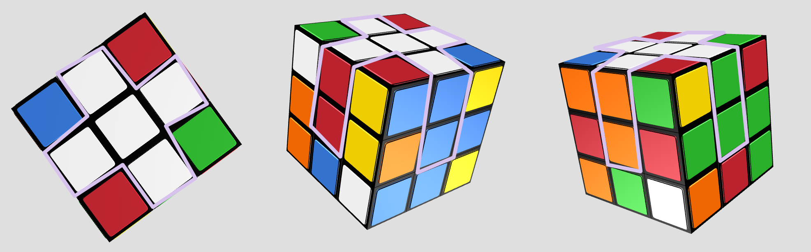

# Rubik's Cube Solution Guide

Historic brief; The Rubik's Cube is a 3D combination puzzle originally invented in 1974 by Hungarian sculptor and professor of architecture Ernő Rubik. Originally called the Magic Cube.

## 0.1 Introduction

There are few rules, that need to be illuminated for ensure a smooth understand of the solving steps.

### 0.2 Pieces's Names

### 0.3 Movement

### 0.4 Algorithms

#### 0.4.1 Righty Alg

Righty Alg or right algorithm; it used to rotate corner or swap positions of of example two edges.
> How it's done?
> > a combination of four moves ``R U R` U` ``

#### 0.4.2 Lefty Alg

Lefty Alg or left algorithm is similar to righty alg in purpose and technique but from left side.
> How it's done?
> > a combination of four moves ``L` U` L U``

## 1.0 Daisy

> This step is abstract, which means, that there are no guides to reach this point. But lucky it's a very straightforward step.

### 1.1 Goal

We aim to get a center in yellow with full white edges.

### 1.2 Steps

- There is no guides for this step, as I said before it's abstract ;)

## 2.0 White Cross

### 2.1 Goal

A white cross with every edge corresponds to the side center color.

### 2.2 Steps

1. Perform a successful [Daisy](#10-daisy).
2. Focus on a certain edge from daisy as example blue one (edge piece with white and blue faces).
3. Then perform `U` until that edge matches with the center. (So you should have a white blue edge above the the blue center).
4. Then perform ``F` F` ``. (You should have now the white-blue edge on bottom layer and blue with blue center)
5. Repeat the previous steps until you match all four colors.

## 3.0 First Layer

### 3.1 Goal

We aim in this step to have a cube's bottom in full white, and to match the first (bottom) layer to center color.

### 3.2 Steps

1. Perform a successful [White Cross](#20-white-cross).
2. Hold the cube as following; ground base is white, top center is yellow and facing center to you is red with blue face being on right side. (Note; red is not an obligation. Feel free to choose any color)
3. You should have the blue-red-white corner piece on top layer. locate it until it's in angle between red face which facing you and blue face on right side.
4. perform the **righty alg** until blue-red-white piece reach the correct spot; on bottom layer and red face with red center and blue face with blue center.
5. Repeat the same technique until you match the four corners on first layout from down side.

## 4.0 Two Layers

### 4.1 Goal

The goal is to have first and second layers from bottom in correct order.

### 4.2 Steps

1. Perform a successful [First Layer](#30-first-layer).
2. Hold the cube so that red is facing you, then rotate the top layer until get either red-green or red-blue edge above the red center.
3. In example you have the red-green edge. perform a top rotate so that you move the red-green edge away from the red face. it should be now in blue face.
4. Then perform **righty alg**.
5. Then Slide the whole cube so that you face the green face (Right Slide).
6. Perform a **lefty alg**.

Note:

- Any face can be used instead of red face.
- **important** you do _step 3_ to the other direction of the position you want the edge to go to. like if you have red-blue edge then you should do top rotate so that that edge be on green face.
- **important** If you moved the edge to right side away then you perform lefty alg followed by righty alg. and if you moved the edge to left side away you perform the righty alg followed by lefty alg.

## 5.0 Yellow Cross

> This step has three possible start points; the line, the angle and the dot.

### 5.1 Goal

The object here is to have a yellow cross on the top face.

### Case 5-A (The Line)

#### Case 5-A Steps

1. Perform a successful [Two Layers](#40-two-layers).
2. Hold the cube so that whites are down, yellows are up and **the angle pointing down and right** as in image.
3. Then perform rotate the only vertical first layers to right. (rotate face facing you to right).
4. Perform the **righty alg**.
5. Then rotate back the rotated layer back to be on top.

### Case 5-B (The Angle)

#### Case 5-B Steps

1. Perform a successful [Two Layers](#40-two-layers).
2. Hold the cube so that whites are down, yellows are up and **the angle pointing down and right** as in image.
3. Then perform rotate the vertical first and second layers to right. (rotate facing and behind facing to right).
4. Perform the **righty alg**.
5. Then rotate back the two vertical layers back to be on top.

### Case 5-C (The Dot)

#### Case 5-C Steps

1. Perform a successful [Two Layers](#40-two-layers).
2. Then perform same technique used in [The Line](#case-5-a-the-line). and you should then get **the angle**.
3. Perform [The Angle](#case-5-b-the-angle) technique.

## 6.0 Match Top 4 Corners

### 6.1 Goal

The aim is to have corners top in the right corresponding position to the sides.

### 6.2 Steps

1. Perform a successful [Yellow Cross](#50-yellow-cross).
2. Hold the cube so yellow faces are up.
3. Rotate the top layer until you get the most matches corners. There are only two scenarios;
   1. First is to have two sided sides matching and the other two not.
      - Slide the whole cube until the two sided corner are on right side.
      - Then perform 3x **righty alg**.
      - Then slide the whole cube to left.
      - Follow that with 3x **lefty alg**.
   2. The diagonal corners matching and the other diagonal are not.
      - You perform same steps, that were used in first scenario but do it 2x.

## 7.0 Yellows Up, Whites Down

### 7.1 Goal

The main object is to have top face full of yellow center, edges and corners.

### 7.2 Steps

1. Perform a successful [Match Top Corners](#60-match-top-4-corners).
2. Hold the cube reversed; White face up and yellow down.
3. Hold steady top and middle layers, then rotate the bottom layer until you get the wrong pointing yellow corner piece in right corner facing you.
4. Perform **righty alg** until yellow face points down like yellow center.
5. Then rotate the bottom layer until you get the second yellow piece, which it's yellow not right. And perform the **righty alg**.

## 8.0 Perfection (Goal)

### 8.1 Goal

The final goal is to solve the full cube.

### 8.2 Steps

1. Perform a successful [Yellow Up](#70-yellows-up-whites-down).
2. After that there are only scenarios;
   1. You get one solved face.
      - Hold the cube, so that the solved face is facing you.
      - Do one **righty alg**.
      - Then do one **lefty alg**.
      - Follow that with 5x **righty alg**.
      - Then do 5x **lefty alg**.
   2. You don't have any full correct faces, and all four to top edges are wrong.
      - Do one **righty alg**.
      - Then do one **lefty alg**.
      - Follow that with 5x **righty alg**.
      - Then do 5x **lefty alg**.
      - Then you should have one full solved face, perform the first scenario.
